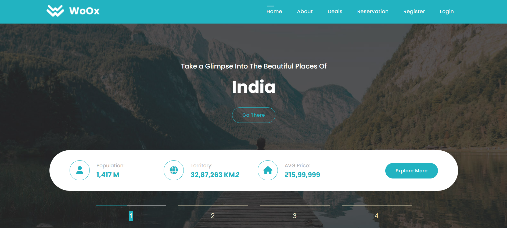
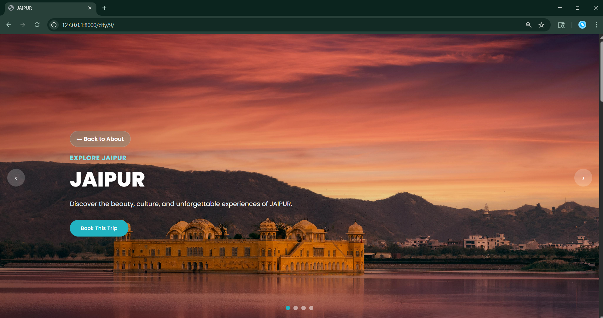
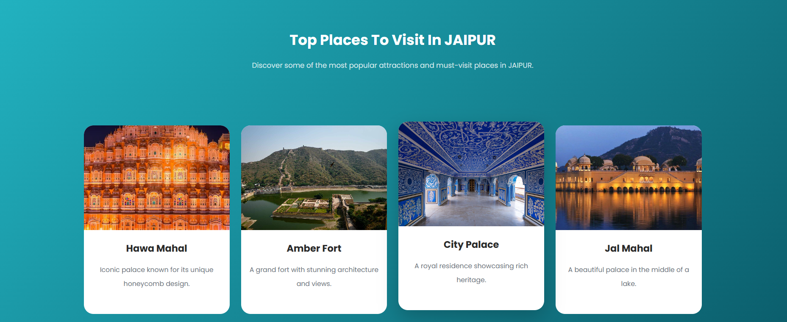
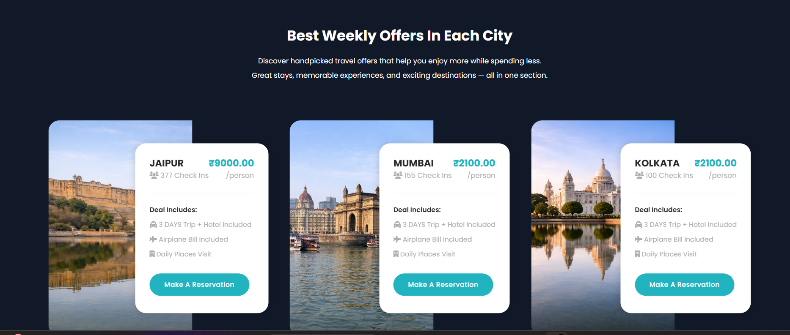
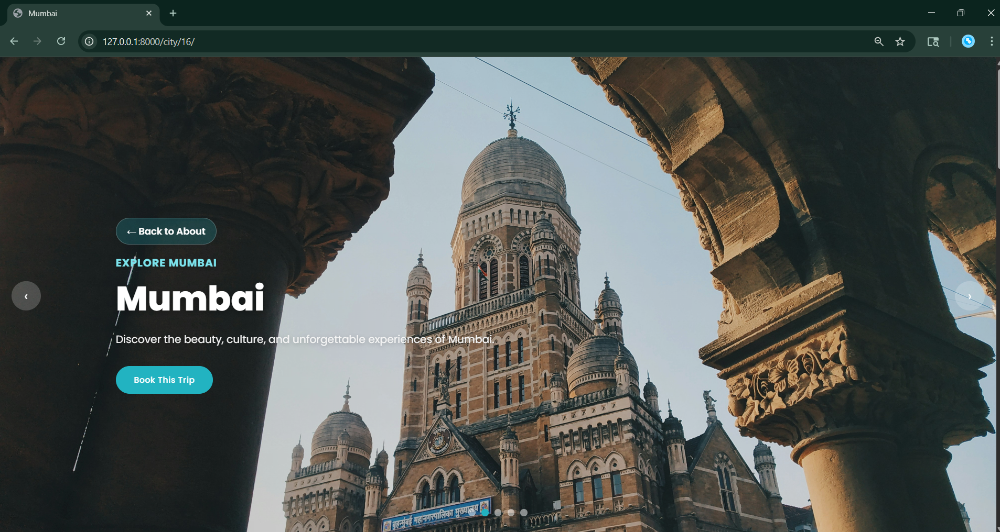
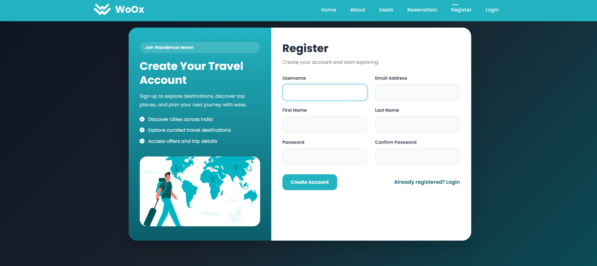
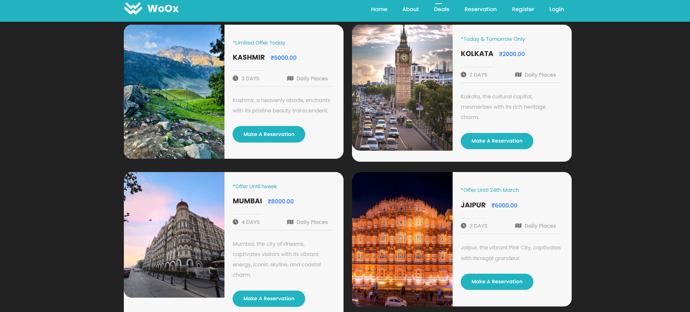

# 🌍 Woox Travel - Django Travel Booking Platform

<div align="center">

### ✈️ Discover • Explore • Book

A modern travel booking web application built with **Python & Django** that allows users to explore destinations across India, discover travel deals, view city attractions, and make travel reservations through a dynamic database-driven platform.

</div>

---

## 🚀 Project Overview

WoOx Travel is a full-stack Django web application designed to provide users with an engaging travel exploration experience.

The platform enables travelers to:

✅ Explore popular Indian destinations

✅ View city-specific attractions and tourist places

✅ Browse travel deals and package offers

✅ Register and manage accounts

✅ Login securely using Django Authentication

✅ Make travel reservations

✅ Experience dynamic content powered by Django ORM and SQLite

---

## ✨ Key Features

### 🔐 Authentication System

* User Registration
* User Login
* Logout Functionality
* Forgot Password Support
* Session-based Authentication

### 🏙️ City Explorer

* Dynamic City Detail Pages
* City-wise Attractions
* Tourist Place Information
* Beautiful Destination Galleries

### 🎁 Travel Deals

* Weekly Travel Offers
* Dynamic Pricing
* Package Information
* Reservation Integration

### 📅 Reservation System

* Travel Booking Workflow
* User Reservation Management
* Database-driven Booking Records

### ⚙️ Backend Functionality

* Django ORM Integration
* Dynamic Database Queries
* MVC/MVT Architecture
* Clean URL Routing
* Template Rendering

---

## 🛠️ Tech Stack

| Technology   | Usage                     |
| ------------ | ------------------------- |
| Python       | Backend Development       |
| Django       | Web Framework             |
| SQLite3      | Database                  |
| HTML5        | Frontend Structure        |
| CSS3         | Styling                   |
| Bootstrap    | Responsive UI             |
| JavaScript   | Client-side Functionality |
| Git & GitHub | Version Control           |

---

## 📸 Project Screenshots

### 🏠 Home Page



### 🏙️ Jaipur City Details Page



### 🏛️ Top Tourist Attractions in Jaipur



### 🌆 Explore Cities & Destinations



### 🌃 Mumbai City Information



### 👤 User Registration



### 🎁 Travel Deals & Offers




---

## 📂 Project Structure

```bash
woox-travel/
│
├── manage.py
├── woox_travel/
├── templates/
├── static/
├── media/
├── users/
├── reservations/
├── city/
├── deals/
└── db.sqlite3
```

---

## ⚡ Installation

### 1️⃣ Clone Repository

```bash
git clone https://github.com/yourusername/woox-travel.git
```

### 2️⃣ Navigate to Project

```bash
cd woox-travel
```

### 3️⃣ Create Virtual Environment

```bash
python -m venv env
```

### 4️⃣ Activate Environment

```bash
env\Scripts\activate
```

### 5️⃣ Install Dependencies

```bash
pip install -r requirements.txt
```

### 6️⃣ Configure Environment Variables

Create a `.env` file:

```env
EMAIL_HOST_USER=your_email@gmail.com
EMAIL_HOST_PASSWORD=your_app_password
```

### 7️⃣ Run Migrations

```bash
python manage.py migrate
```

### 8️⃣ Start Development Server

```bash
python manage.py runserver
```

### 9️⃣ Open Browser

```text
http://127.0.0.1:8000/
```

---

## 🎯 Learning Outcomes

During this project I gained practical experience with:

* Django Models
* Django Views
* Django Templates
* Authentication System
* Session Management
* Database Design
* Django ORM
* Dynamic Content Rendering
* Travel Booking Workflows
* Git & GitHub Version Control

---

## 🔮 Future Improvements

* Payment Gateway Integration
* Email Notifications
* Travel Reviews & Ratings
* Admin Analytics Dashboard
* REST API Integration
* Django REST Framework (DRF)
* Deployment on Render/AWS

---

## 👨‍💻 Author

**Harsh Shah**

Python Backend Developer | Django Developer

📧 Open to Internship & Entry-Level Backend Opportunities

---

⭐ If you like this project, consider giving it a star.
